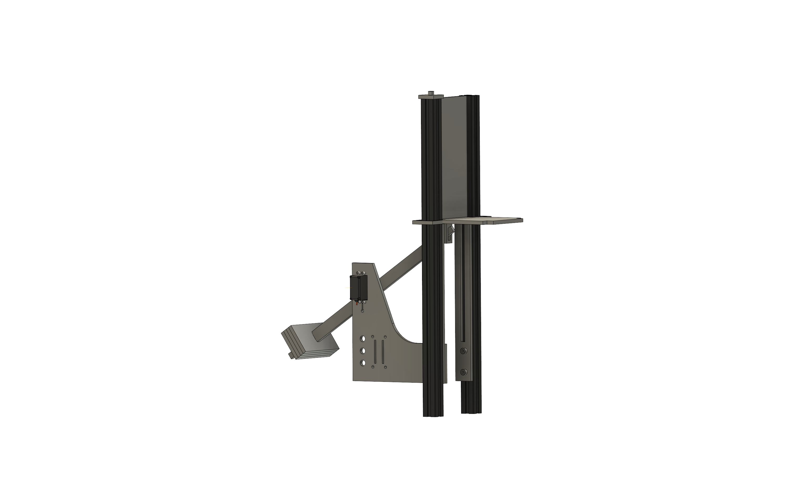

# Door-Module

  

### Parts List

| Item | Quantity | Notes | Product Link |
| :---: | :---: | :---: | :---: |
| Arduino Nano | 1 piece | with pin headers | [arduino.cc](https://store-usa.arduino.cc/products/arduino-nano?selectedStore=us) |
| Whadda Servo MG995 | 1 piece | with mounting hardware | [whadda.com](https://whadda.com/product/servo-mg995-wpm603/) |
|  |  |  |
|  |  |  |
|  |  |  |
|  |  |  |
|  |  |  |
|  |  |  |
|  |  |  |
|  |  |  |

Lasercutting
--------------------
Lasercutter Settings
Device
Acrylic 6mm any color

3D Printing
--------------------

Wiring Diagram
--------------------
Connections and an image or so

Printer Settings
Device
Or 3d printing material

Screws
Aluminum Rails
Rail Nuts
Jumper Cables
Office Clamp
BNC Plugs (with unterlagscheiben und muttern) https://www.digikey.de/de/products/detail/amphenol-rf/31-221-RFX/100648
Sprayable Food Grease http://www.crceurope.com/crc/CRCproductdetail.csp?division=industry&product=FG FOOD GREASE
USB Cable

Schrauben M4 M3 M6 mit unterlagsscheiben und muttern

